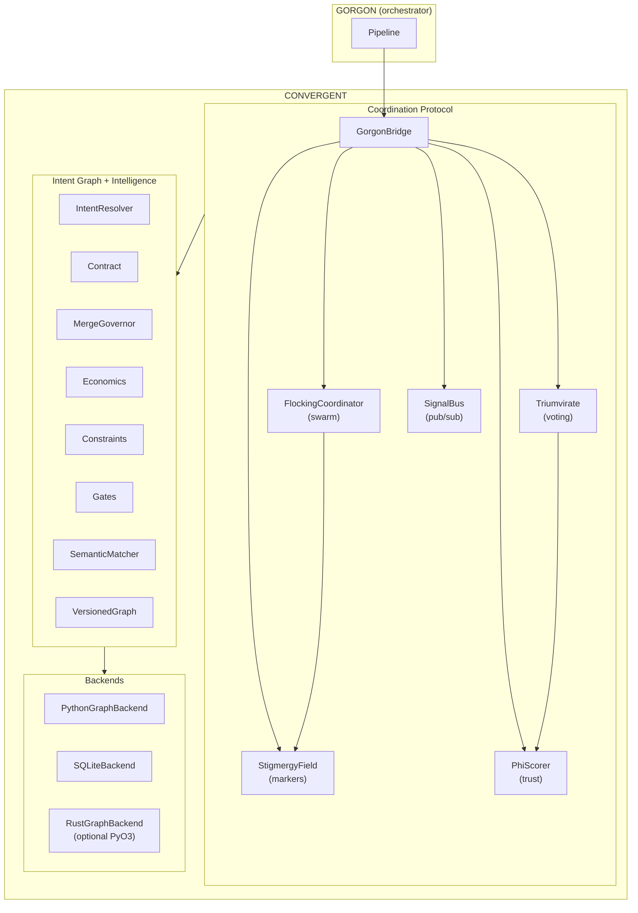

# Convergent

**Multi-agent coherence and coordination for AI systems — combining ambient intent awareness with bio-inspired coordination.**

Convergent solves the fundamental problem of parallel AI agent coordination: multiple agents generating code simultaneously will produce incompatible outputs because they diverge from a shared starting point without shared understanding of where they're going.

It provides two complementary layers:

1. **Intent Graph** — Agents observe a shared, append-only graph of architectural decisions and independently converge on compatible outputs. No inter-agent communication required. Coherence emerges from ambient awareness.

2. **Coordination Protocol** — Three bio-inspired patterns that sit on top of the intent graph: **Triumvirate voting** (phi-weighted consensus), **Stigmergy** (ant-trail markers for indirect learning), and **Flocking** (local rules for emergent group behavior).

The intent graph lets agents *see* what others are doing. The coordination protocol lets agents *decide together*, *learn from outcomes*, and *avoid collisions*.

## Why Convergent?

Every multi-agent coding framework struggles with parallel agent coordination. They all use some form of message passing or supervisor coordination. Convergent introduces two new primitives:

- **Ambient awareness** — A shared intent graph that makes divergence structurally unlikely. Like how birds flock — they don't send messages, they each follow simple rules relative to their neighbors and coherent behavior emerges.
- **Bio-inspired coordination** — Trust scores that evolve from outcomes (phi-weighted scoring), pheromone-like trail markers that decay over time (stigmergy), and local rules that produce emergent group behavior (flocking).

## Architecture



## Quick Start

```bash
# Clone
git clone https://github.com/AreteDriver/convergent.git
cd convergent

# Python-only (no Rust needed — uses pure-Python fallback)
PYTHONPATH=python python -m convergent
PYTHONPATH=python pytest tests/ -v

# With Rust core (optional, for production performance)
pip install maturin
maturin develop --release
pytest tests/ -v
cargo test
```

### Intent Graph — Ambient Awareness

```python
from convergent import IntentResolver, PythonGraphBackend, Intent, InterfaceSpec

resolver = IntentResolver(backend=PythonGraphBackend())

# Agent A publishes what it's building
resolver.publish(Intent(
    intent_id="auth-service",
    agent_id="agent-a",
    description="JWT authentication service",
    interfaces=[
        InterfaceSpec(name="User", kind="class", tags=["auth", "model"]),
        InterfaceSpec(name="AuthService", kind="class", tags=["auth", "service"]),
    ],
))

# Agent B checks for overlapping work before starting
overlaps = resolver.find_overlapping(Intent(
    intent_id="user-module",
    agent_id="agent-b",
    description="User management",
    interfaces=[
        InterfaceSpec(name="User", kind="class", tags=["auth", "model"]),
    ],
))
# overlaps shows agent-a already owns the User class
```

### Coordination Protocol — Consensus Voting

```python
from convergent import GorgonBridge, CoordinationConfig

bridge = GorgonBridge(CoordinationConfig(db_path=":memory:"))

# Create a consensus request
request_id = bridge.request_consensus(
    task_id="pr-42",
    question="Should we merge this PR?",
    context="All tests pass, adds new auth endpoint",
)

# Agents vote (phi-weighted by their track record)
bridge.submit_agent_vote(request_id, "agent-1", "reviewer", "claude:sonnet", "approve", 0.9, "LGTM")
bridge.submit_agent_vote(request_id, "agent-2", "tester", "claude:haiku", "approve", 0.8, "Tests pass")
bridge.submit_agent_vote(request_id, "agent-3", "reviewer", "claude:sonnet", "reject", 0.4, "Minor nits")

# Evaluate — weighted approve > weighted reject
decision = bridge.evaluate(request_id)
print(decision.outcome)  # DecisionOutcome.APPROVED

# Record outcomes to update trust scores
bridge.record_task_outcome("agent-1", "code_review", "approved", file_paths=["src/auth.py"])
```

### Stigmergy — Trail Markers

```python
from convergent import StigmergyField

field = StigmergyField(db_path=":memory:")

# Agent leaves markers for future agents
field.leave_marker("agent-1", "file_modified", "src/auth.py", "Added JWT validation")
field.leave_marker("agent-1", "known_issue", "src/db.py", "Race condition in connection pool")
field.leave_marker("agent-2", "pattern_found", "src/api.py", "Uses repository pattern for DB access")

# Future agent gets context before working on these files
context = field.get_context_for_agent(["src/auth.py", "src/db.py"])
# Returns formatted context with marker types, strengths, and content

# Markers decay over time (evaporation)
field.evaporate()  # Weak/old markers auto-removed
```

## How It Works

### The Intent Graph

A shared, append-only data structure where agents publish their architectural decisions as **Intents**:

- What they decided to build
- What interfaces they provide / require
- What constraints their decisions impose on other scopes

Each intent has a **stability score** (0.0–1.0) based on evidence. Low stability = soft suggestion. High stability (code committed, tests passing) = hard constraint. Early decisions with high evidence become **attractors** that pull later decisions toward compatibility.

### The Coordination Protocol

Three bio-inspired patterns layered on top of the intent graph:

| Pattern | Inspiration | What It Does |
|---------|-------------|-------------|
| **Triumvirate** | Roman governance | N agents vote on decisions, weighted by trust scores. Supports ANY/MAJORITY/UNANIMOUS quorum. |
| **Stigmergy** | Ant pheromone trails | Agents leave markers that decay over time. Multiple agents confirming the same observation reinforces the signal. |
| **Flocking** | Bird flocking | Three local rules — alignment (consistent style), cohesion (stay on task), separation (don't overlap) — produce emergent group coordination. |

### Phi-Weighted Scoring

Agent votes are weighted by their **phi score** — a Bayesian trust metric that evolves from outcomes:

- Approvals increase trust, rejections decrease it
- Recent outcomes weighted more heavily (exponential decay)
- Bounded [0.1, 0.95] — never fully trusted, never fully distrusted
- Per-agent AND per-skill-domain (good at review ≠ good at testing)

## Feature Matrix

| Feature | Status | Module |
|---------|--------|--------|
| Intent graph (publish, resolve, overlap) | Done | `resolver.py` |
| Structural matching | Done | `matching.py` |
| Semantic matching (LLM-powered) | Done | `semantic.py` |
| Contract validation | Done | `contract.py` |
| Three-layer stack (constraints → intents → economics) | Done | `constraints.py`, `economics.py` |
| MergeGovernor | Done | `governor.py` |
| VersionedGraph (branch, merge, snapshot) | Done | `versioning.py` |
| Gates (pytest, mypy, compile, custom) | Done | `gates.py` |
| SQLite backend (WAL mode) | Done | `sqlite_backend.py` |
| Rust backend (PyO3, optional) | Done | `rust_backend.py` |
| Async backend | Done | `async_backend.py` |
| CLI inspector | Done | `__main__.py` |
| Visualization (text, DOT, HTML, matrix) | Done | `visualization.py` |
| Replay system | Done | `replay.py` |
| Benchmarks | Done | `benchmark.py` |
| Protocol data models | Done | `protocol.py` |
| Phi-weighted scoring | Done | `scoring.py`, `score_store.py` |
| Triumvirate voting | Done | `triumvirate.py` |
| Signal bus (filesystem pub/sub) | Done | `signal_bus.py` |
| Stigmergy trail markers | Done | `stigmergy.py` |
| Flocking swarm coordination | Done | `flocking.py` |
| Gorgon integration bridge | Done | `gorgon_bridge.py` |

## Key Concepts

| Concept | Description |
|---------|-------------|
| **Intent** | A structured decision an agent has made (what it builds, provides, requires) |
| **Stability** | Confidence score (0.0–1.0) based on evidence (tests, commits, dependents) |
| **Resolution** | An agent reading the intent graph and adjusting for compatibility |
| **Convergence** | Multiple agents independently arriving at compatible outputs |
| **Phi score** | Bayesian trust metric per agent per skill domain, evolving from outcomes |
| **Stigmergy** | Indirect communication through environment modification (trail markers) |
| **Flocking** | Emergent group behavior from simple local rules (alignment, cohesion, separation) |
| **Quorum** | Agreement level required for consensus (any, majority, unanimous) |

## Integration with Gorgon

Convergent is a standalone library, but it's designed as the coordination backbone for [Gorgon](https://github.com/AreteDriver/Gorgon). Two integration points:

```python
# 1. Intent graph — delegation coherence checking
from convergent import create_delegation_checker
checker = create_delegation_checker(min_stability=0.3)

# 2. Coordination protocol — full Phase 3 bridge
from convergent import GorgonBridge, CoordinationConfig
bridge = GorgonBridge(CoordinationConfig(db_path="./coordination.db"))

# Before agent works: enrich prompt with context
context = bridge.enrich_prompt("agent-1", "implement auth", ["src/auth.py"])

# After agent works: record outcome, update scores, leave markers
bridge.record_task_outcome("agent-1", "coding", "approved", file_paths=["src/auth.py"])

# For quality gates: run consensus vote
request_id = bridge.request_consensus("task-1", "Merge PR?", "All tests pass")
```

## Tech Stack

- **Python >=3.10** — pure Python, zero production dependencies
- **Rust (optional)** — PyO3 bindings for performance-critical graph operations
- **SQLite** — persistence for intent graph, scores, stigmergy markers
- **pytest** — 670+ tests, 97% coverage

## License

MIT
